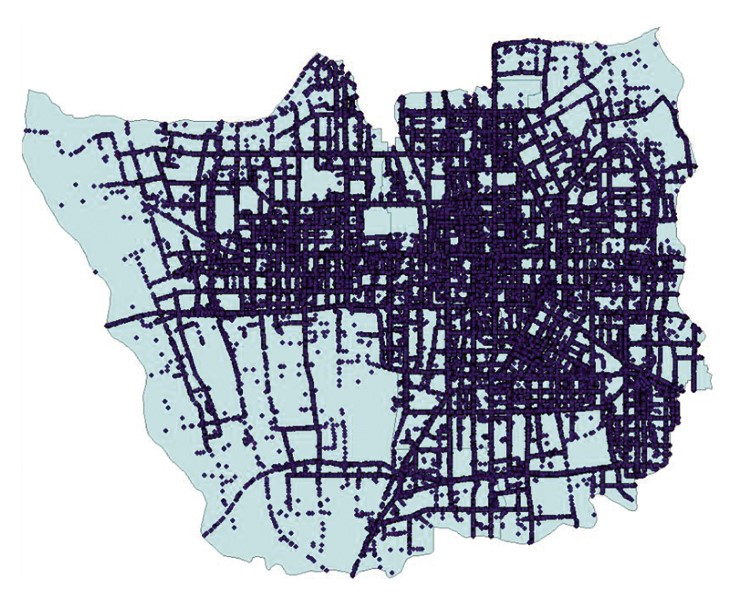
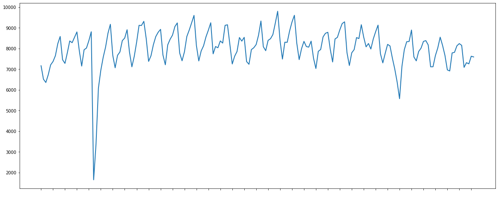

# Taxi Demand Prediction

  

Forecasting is ubiquitous. In addition to strategic forecasts, such as those predicting revenue, production, and spending, organizations across industries need accurate short-term, tactical forecasts, such as the amount of goods to be ordered and number of employees needed, to keep pace with their growth
 
With this we expect to formulate an efficient method to predict the demand of taxis over time 

## Now what makes forcasting a challenge ? 
There are a lot of constraints to forcasting in this case that would be diverse behavior and interests, physical constraints, and unpredictability which might also include geographic distance and road throughput move forecasting from the temporal to spatio-temporal domains.
 
But looking at a sample data which is yellow taxi trip data in NYC over 6 months we can clearly notice some seasonality (weekly and monthly) there are a few peaks because of the sheer number of major holidays scattered throughout the year.
 

  

 
There is a perticular dip in the demand towards the starting this is perticularly intresting because on the day this happened snowfall was at its peak so this clearly stats that we have to take weather data in account.
 
If we zoom in and switch to hourly data for the month of July 2017, you will notice both daily and  weekly (7X24). You may notice that weekends tend to be more busy.
 

## Data and other miscellaneous stuff

The data was provided but I find it very underwhelming for this kind of task with such complexity.
 

  

 
And with a lot of external factors affecting it so the data used was from - [https://www.nyc.gov/site/tlc/about/data.page](s) which is the official site of NYC gov 
with this weather data was also used which was again downloaded from the official gov website.
 
Computing the loss throughout the project was done by RMSE which is also used by a lot of time series models. 
 

## Prominent forcasting approaches
Apart from qualitative methods, quantitative forecasting approaches can be grouped as follows: model-based or causal classical, statistical methods, and machine learning approaches.
 
When the underlying mechanisms are not known or are too complicated, e.g., the stock market, or not fully known, e.g., retail sales, it is usually better to apply a simple statistical model. Popular classical methods that belong to this category include ARIMA (autoregressive integrated moving average), exponential smoothing methods, such as Holt-Winters, and the Theta method, which is less widely used, but performs very well.

### Linear Regression 
some stuff

### ARIMA

One of the statistical model used here is ARIMA which again stands for autoregressive integrated moving average which is basically linear regression combined with moving average to make the model more robust.

- ARIMA makes use of lagged moving averages to smooth time series data.
- Autoregressive models implicitly assume that the future will resemble the past.
 
But ofcourse this has to come with its own short comings which include data assumptions which is 
ARIMA models always asume that the data is stationary.

#### what is Stationarity ?
this simply means that the model assumes that the data was a constant mean with a constant standard deviation throughout the data and has no seasonality but as we just saw with the figure aur data does has some kind of seasonality so the data is not very stationary the exact number comes out to be 12.3453e-13. which is acceptable by the standards so we went ahead and gave it a short and here is what it results in. 

### Spatial Temporal Graph Neural Networks 

The data we have is mainly time varying as supposed to being spatialy varying and such information requires a graph and Neural Network which are developed to deal with time varying features of a graph can be considered as Spatio-Temporal graph neural nets.
 

### Results 
add images

### Final Conclutions 
add some more text
